<p align="center">
  
</p>
<p align="center">
  
</p>

<p align="center">
  
</p>


# M Company Help Bot 🚀

**aiogram v3** asosidagi **ko‘p tilli** (UZ / EN / RU) Telegram yordamchi bot.  
Falsafa: *“Ishlaydigan tizimlar. Real natijalar.”* 

<p align="left">
  <a href="https://www.python.org/"></a>
  <a href="https://docs.aiogram.dev/"></a>
  
</p>

---

## ✨ Asosiy imkoniyatlar

- 🌐 **3 til**: Uzbek / English / Russian (`app/locales.py`)
- 🧩 **Bo‘limlar**:
  - **Xizmatlar**: CRM & Avtomatizatsiya, Vebsayt, Lead Generation, Arxitektura, Target & Sotuv, Call-center
  - **Bizning loyihalar** (media bilan): Target Pro, Agroboost, RoboticsLab, iService, Falco, Food Quest, IMAC, TATU
  - **Aloqa**: manzil, tel, email, ish vaqti, ijtimoiy tarmoqlar
  - **Biz haqimizda**: M Company yondashuvi
- ❓ **FAQ → Guruh → User** oqimi:
  Foydalanuvchi savoli M Company guruh(lar)i ga boradi → admin **reply** qiladi → bot javobni foydalanuvchi **DM**iga yetkazadi
- 🔙 **Inline “Orqaga”** tugmalari, ikonlar, tilga mos matnlar
- 🆔 **/id**: chat ID ni olish
- 🧾 **Loglar**: `loguru` orqali `bot.log` ga yoziladi

---

## 🏗️ Texnologiyalar

- Python 3.12+
- aiogram v3 (async, typed handlers)
- pydantic-settings (.env validatsiya)
- loguru (loglash)
- python-dotenv (ixtiyoriy)

---

## 📁 Tuzilma
```
mcompanyhelpbot/
├─ app/
│ ├─ main.py # Kirish nuqtasi
│ ├─ config.py # .env dan o‘qish, validatsiya
│ ├─ locales.py # UZ/EN/RU matnlar
│ ├─ handlers/
│ │ ├─ services.py
│ │ ├─ projects.py
│ │ ├─ faq.py # FAQ → Group → User oqimi
│ │ └─ ...
│ ├─ keyboards/
│ └─ storage/
│ └─ memory.py
├─ requirements.txt
├─ .gitignore
└─ README.md

```


---

## ⚡️ Tez start

```bash
# 1) Virtual muhit (tavsiya)

python3 -m venv .venv
source .venv/bin/activate

# 2) Kutubxonalar
```
pip install --upgrade pip
pip install -r requirements.txt
```

# 3) .env (namuna)

# BOT_TOKEN=1234567890:AAA...your_token
# ADMIN_IDS=111111111,222222222
# FAQ_GROUP_IDS=-1001234567890,-1009876543210

# 4) Ishga tushirish
```python3 -m app.main```


sequenceDiagram
  autonumber
  participant U as User
  participant B as Bot
  participant G as M Company Group
  participant A as Admin
  U->>B: FAQ → "Savol berish" → matn
  B->>G: Savol (user info, til, matn) + "reply qiling"
  A->>G: Reply (javob)
  G->>B: Reply event
  B->>U: DM: “Ism, javob…”
  B->>G: "✅ yuborildi"


🧪 Muammolar va yechimlar

Bad Request: chat not found — Guruh ID noto‘g‘ri / bot guruhga qo‘shilmagan / ruxsat yo‘q. /id bilan tekshiring.

query is too old / invalid — Callback’larda await cb.answer() chaqirilgan bo‘lsin; uzoq bloklamang.

ModuleNotFoundError — .venv ichida pip install -r requirements.txt.

Externally managed environment — python3 -m venv .venv && source .venv/bin/activate.


👤 Muallif

Muhammadziyo Begaliyev — Telegram: @Muhammadziyo7008


